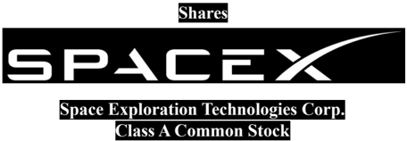

# f003 — SpaceX Class A Common Stock Shares offering cover logo

The figure shows the cover title block of the SpaceX S-1 offering, identifying the issuer as Space Exploration Technologies Corp. and the security being offered as Class A Common Stock.

The image displays a heading label 'Shares' above the SpaceX wordmark logo. Below the logo, the full legal company name 'Space Exploration Technologies Corp.' is printed, followed by the security designation 'Class A Common Stock.' This is consistent with a prospectus cover page identifying the offering instrument.

**Entities:** SpaceX, Space Exploration Technologies Corp., Class A Common Stock, S-1, IPO, shares

