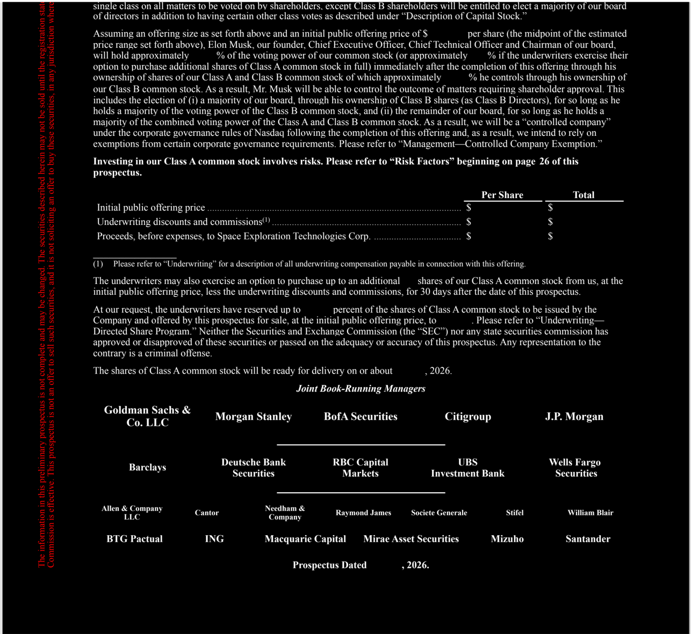

# f004 — SpaceX S-1 IPO Prospectus Cover — Underwriter Syndicate Table 2026

The cover page of Space Exploration Technologies Corp's IPO prospectus showing the offering price table with blank dollar amounts and the full underwriter syndicate, dated 2026.

This is the back cover/final page of a preliminary IPO prospectus for Space Exploration Technologies Corp (SpaceX), showing a three-row pricing table with 'Per Share' and 'Total' columns for initial public offering price, underwriting discounts and commissions, and proceeds before expenses — all dollar values left blank as is standard for a preliminary prospectus. Below the table, the full underwriting syndicate is listed in tiered rows by seniority, with Goldman Sachs, Morgan Stanley, BofA Securities, Citigroup, and J.P. Morgan as lead bookrunners, followed by three additional tiers of co-managers. The document is dated 2026 with the exact date left blank.

| field | value |
|---|---|
| Initial public offering price — Per Share ($) | [blank] |
| Initial public offering price — Total ($) | [blank] |
| Underwriting discounts and commissions — Per Share ($) | [blank] |
| Underwriting discounts and commissions — Total ($) | [blank] |
| Proceeds, before expenses, to Space Exploration Technologies Corp — Per Share ($) | [blank] |
| Proceeds, before expenses, to Space Exploration Technologies Corp — Total ($) | [blank] |

**Entities:** Space Exploration Technologies Corp, SpaceX, Goldman Sachs & Co. LLC, Morgan Stanley, BofA Securities, Citigroup, J.P. Morgan, Deutsche Bank Securities, RBC Capital Markets, UBS Investment Bank, Wells Fargo Securities, Allen & Company LLC, Citi, Needham & Company LLC, Macquarie Capital, Mirae Asset Securities, Mizuho, Santander, BTG Pactual, ING, Class A common stock, S-1, IPO, prospectus, underwriting discounts, 2026

