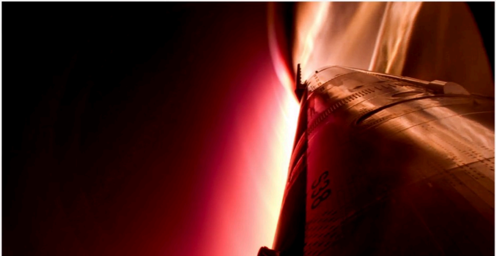

# f005 — SpaceX rocket vehicle re-entry plasma fire photo

Close-up photograph of a SpaceX vehicle structure surrounded by intense re-entry plasma and flames, illustrating the thermal environment experienced during atmospheric descent.

The image is a dramatic close-up photograph showing the exterior panel structure of a large metallic rocket or spacecraft body engulfed in bright orange-white plasma or fire against a dark background. The metallic surface, which appears to show panel seams and riveted or bolted structure, is bathed in intense red-orange light from the surrounding combustion or plasma. No axes, labels, or data overlays are present; the image is purely photographic documentation of a high-heat flight event.

**Entities:** SpaceX, re-entry, plasma, thermal protection, rocket body, Starship, atmospheric re-entry, heat shield

