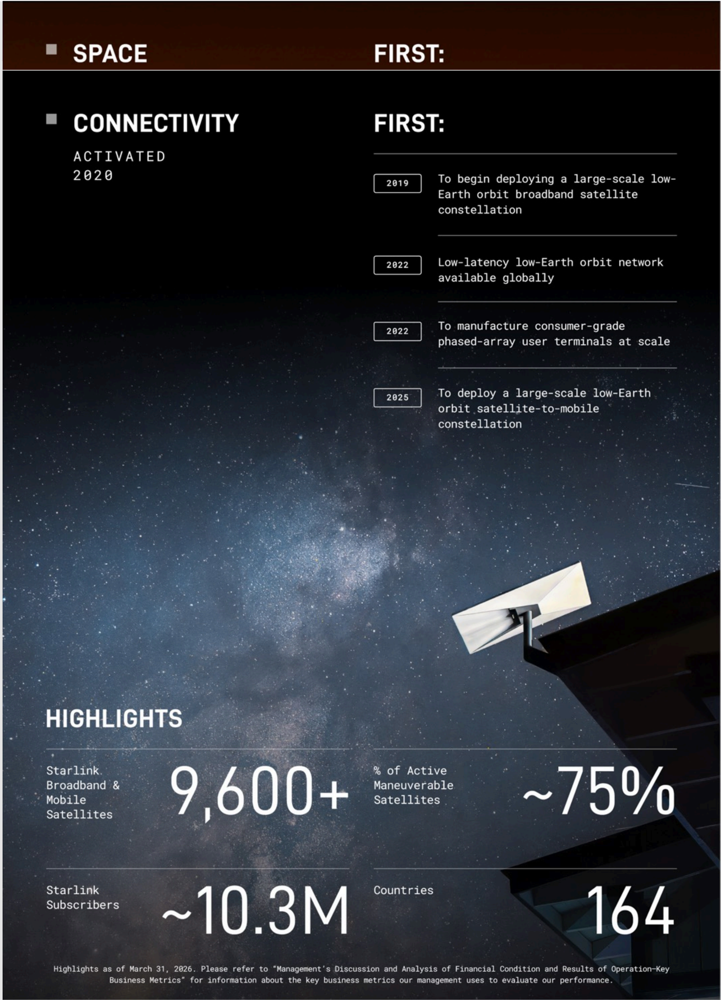

# f006 — SpaceX Starlink Connectivity Space First: 9,600+ Satellites 10.3M Subscribers

This infographic highlights SpaceX Starlink's 'Space First' milestones in connectivity, showing four industry firsts from 2019–2025 alongside key metrics as of March 31, 2025: 9,600+ satellites, ~10.3M subscribers, and service in 164 countries.

The figure is organized as a 'Space First: Connectivity' infographic with two sections. The upper section presents a chronological list of four firsts: beginning large-scale LEO broadband satellite deployment (2019), making a low-latency LEO network available globally (2022), manufacturing consumer-grade phased-array user terminals at scale (2022), and deploying a large-scale LEO satellite-to-mobile constellation (2025). The lower 'Highlights' section displays four headline KPIs—satellite count, active maneuverable satellite percentage, subscriber count, and country coverage—reflecting the scale and reach of the Starlink network.

| field | value |
|---|---|
| Starlink Broadband & Mobile Satellites | 9,600+ |
| % of Active Maneverable Satellites | ~75% |
| Starlink Subscribers | ~10.3M |
| Countries | 164 |

**Entities:** SpaceX, Starlink, LEO, low-Earth orbit, broadband, satellite constellation, phased-array, user terminals, satellite-to-mobile, connectivity

