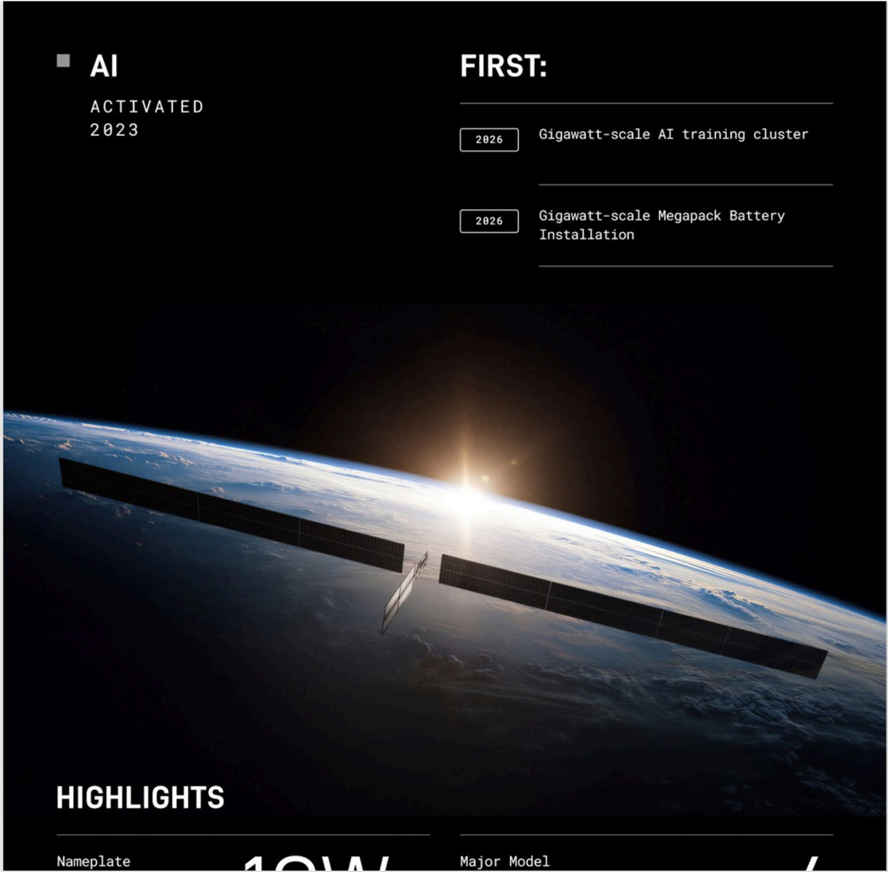

# f007 — SpaceX AI Activated 2023 — Gigawatt-Scale Firsts Infographic

An infographic page highlighting SpaceX's AI division, activated in 2023, with milestone firsts including a gigawatt-scale AI training cluster and gigawatt-scale Megapack Battery Installation, set against an orbital image of a Starlink satellite.

The figure is an infographic with a full-bleed photograph of a Starlink satellite in low Earth orbit against a sunlit Earth horizon as background. The upper-left panel labels the section 'AI' with 'ACTIVATED 2023' below it. The upper-right panel under 'FIRST:' lists two chronological milestones: 2023 — Gigawatt-scale AI training cluster; 2024 — Gigawatt-scale Megapack Battery Installation. A 'HIGHLIGHTS' section appears at the bottom with partially visible data fields labeled 'Nameplate' and 'Major Model,' but these rows are cut off and their values are not fully legible.

| field | value |
|---|---|
| Gigawatt-scale AI training cluster (year) | 2023 |
| Gigawatt-scale Megapack Battery Installation (year) | 2024 |

**Entities:** SpaceX, AI, Starlink, Megapack, Gigawatt-scale AI training cluster, Gigawatt-scale Megapack Battery Installation

