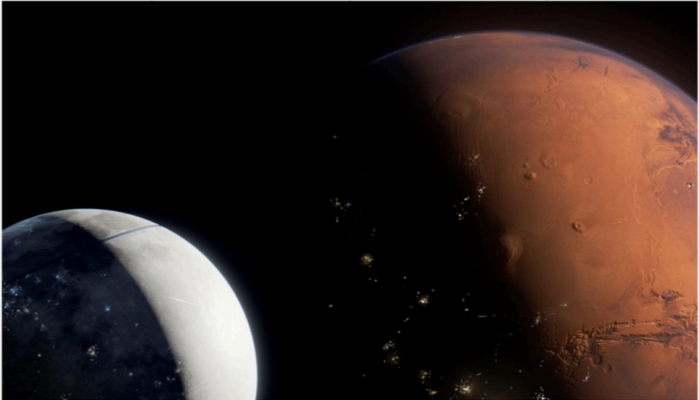

# f008 — Earth and Mars planetary illustration — SpaceX S-1 figure

A rendered illustration showing Earth (crescent, left) and Mars (right) in space, evoking SpaceX's interplanetary mission context.

The image is a space illustration depicting a crescent view of Earth on the lower left, showing blue oceans and white cloud cover, alongside a large, detailed view of Mars on the right, rendered in its characteristic reddish-orange surface with visible craters and terrain. The black background of space separates the two planets. No axes, labels, or data annotations are present; the image functions as a visual thematic backdrop rather than a data chart.

**Entities:** Earth, Mars, SpaceX, interplanetary, planets, space, craters

