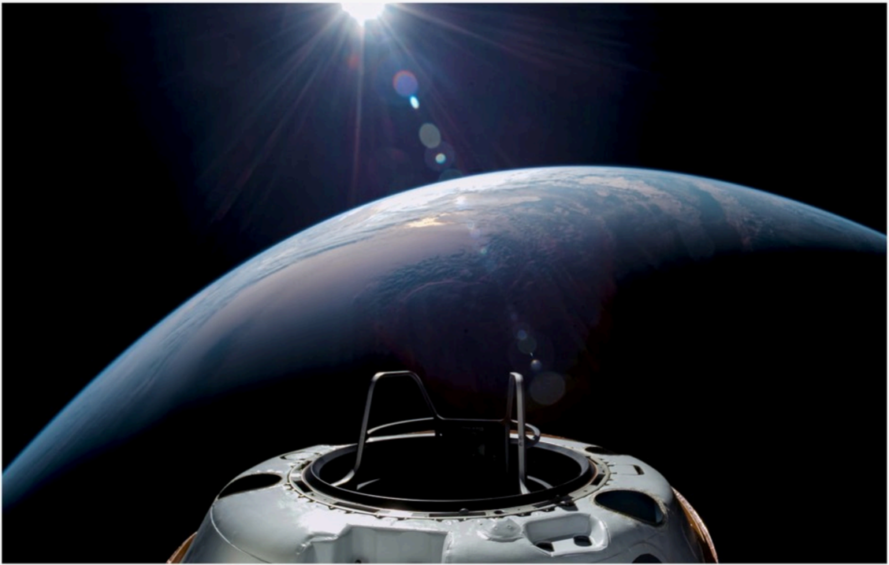

# f009 — Dragon capsule in low Earth orbit photo

A SpaceX Dragon spacecraft is photographed in orbit against the curvature of Earth with sunlight visible on the horizon.

The photo is taken from an exterior vantage point looking down along the top of a Dragon capsule, showing its domed nose/hatch section in the foreground. Earth's curved horizon fills the mid-ground with a thin blue atmospheric limb, and a bright solar flare/lens flare appears near the top of the frame against the blackness of space. No axes, scales, or data series are present; this is an operational orbital photography image. The image conveys the operational capability of Dragon in low Earth orbit.

**Entities:** SpaceX, Dragon, low Earth orbit, LEO, spacecraft, capsule, Earth, atmosphere

