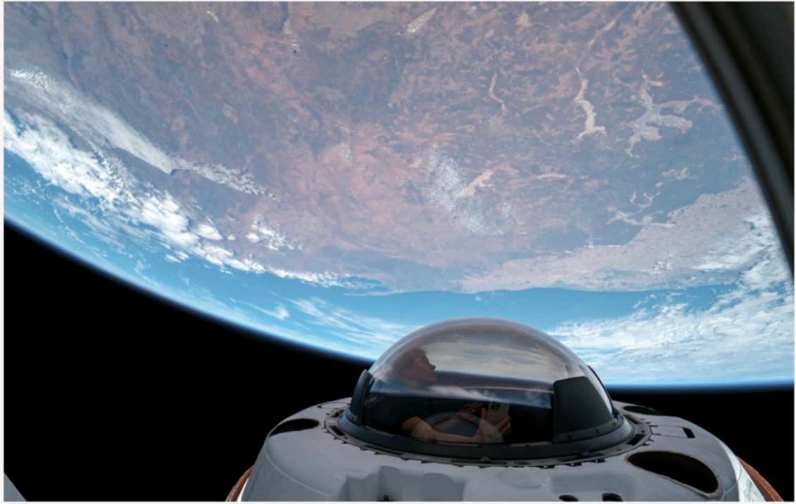

# f010 — SpaceX Dragon Cupola dome over Earth orbital photo

A photo taken from orbit showing the SpaceX Crew Dragon spacecraft's cupola window with Earth's surface and atmosphere visible below, illustrating the panoramic view enabled by the capsule's transparent dome.

The image is a photograph taken in low Earth orbit, looking outward from inside or near the Dragon spacecraft at its large hemispherical cupola window. Earth dominates the lower portion of the frame, showing a curved horizon, blue atmosphere, cloud formations, and what appears to be a continental landmass with varied terrain. The transparent dome structure of the cupola occupies the upper-center foreground. The scene conveys the scale and proximity of Earth from the Dragon spacecraft's orbit.

**Entities:** SpaceX, Crew Dragon, Dragon capsule, cupola, Inspiration4, low Earth orbit, LEO, International Space Station

