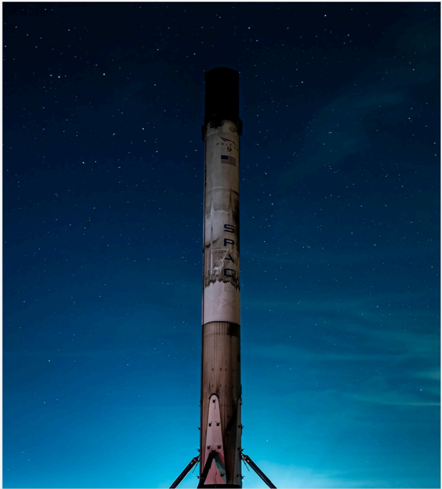

# f011 — SpaceX Falcon 9 booster rocket night photo

A recovered SpaceX Falcon 9 first-stage booster stands upright on its landing legs under a starry night sky, illustrating SpaceX's reusable rocket capability.

The image is a nighttime photograph of a SpaceX Falcon 9 first-stage booster standing vertically on its four deployed landing legs. The rocket is illuminated against a deep blue-to-black gradient sky filled with stars. The 'SPACEX' logo is visible on the side of the booster. The photo conveys the scale and aesthetic of SpaceX's reusable launch vehicle hardware post-landing.

**Entities:** SpaceX, Falcon 9, booster, first stage, reusable rocket, landing legs

