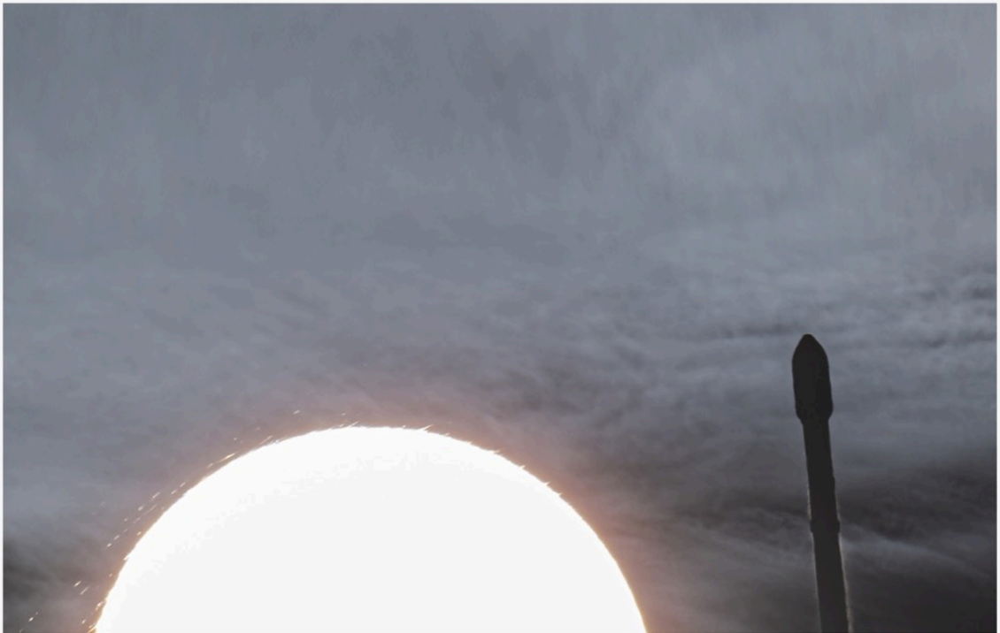

# f012 — SpaceX rocket launch photo with bright engine plume

A SpaceX rocket lifts off against an overcast sky, with a large luminous launch plume dominating the left of the frame and the rocket vehicle visible to the right.

The photograph shows a SpaceX rocket (likely Falcon 9) during or just after ignition, with a massive bright circular glow on the left side of the frame representing the engine exhaust plume or launch flash. The rocket vehicle itself is visible as a tall slender structure on the right side of the image. The background is an overcast, grey sky with clouds visible around the plume. No data axes or series are present; this is a launch photography still.

**Entities:** SpaceX, Falcon 9, rocket launch, launch plume, engine exhaust

