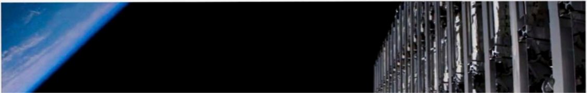

# f013 — Starlink satellite stack in orbit above Earth — on-orbit photo

The figure shows a Starlink satellite stack photographed in low Earth orbit, with the Earth's curved horizon and blue atmospheric limb visible at left.

The photograph is taken from orbit looking along the length of a deployed Starlink flat-panel satellite stack, whose dense grid of antennas and structural frames fills the right half of the frame. The left portion of the image shows the darkness of space and the distinct blue atmospheric limb of Earth curving across the upper-left corner. No axes, series, or quantitative markings are present; the image serves as a visual illustration of Starlink hardware in its operational environment.

**Entities:** Starlink, SpaceX, LEO, low Earth orbit, satellite constellation, flat-panel satellite, Earth, atmosphere

