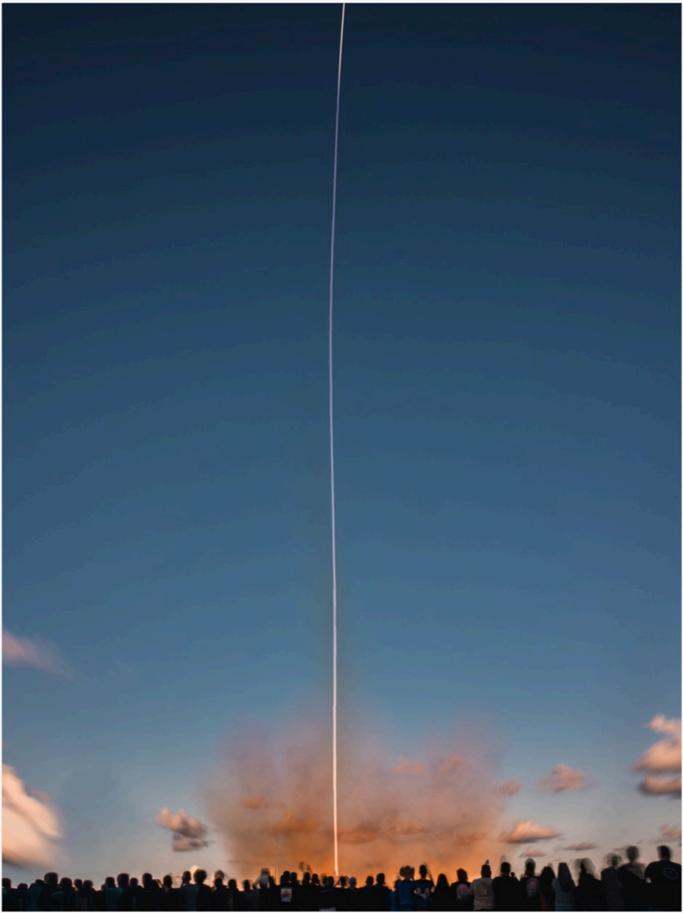

# f014 — SpaceX rocket launch at dusk with crowd spectators photo

A photograph of a rocket launching at dusk, showing the vehicle's bright streak ascending into a blue sky above an orange exhaust plume, watched by a silhouetted crowd of spectators.

The image is a vertical photograph taken at dusk showing a rocket ascending nearly straight up, leaving a bright white streak of light against a deep blue sky. At the base of the streak, a large orange-hued exhaust cloud billows outward. In the foreground, a large crowd of spectators appears as dark silhouettes against the orange glow. The sky transitions from warm orange near the horizon to deep blue at the top of the frame, with a few clouds visible.

**Entities:** SpaceX, rocket launch, exhaust plume, dusk, launch spectators

