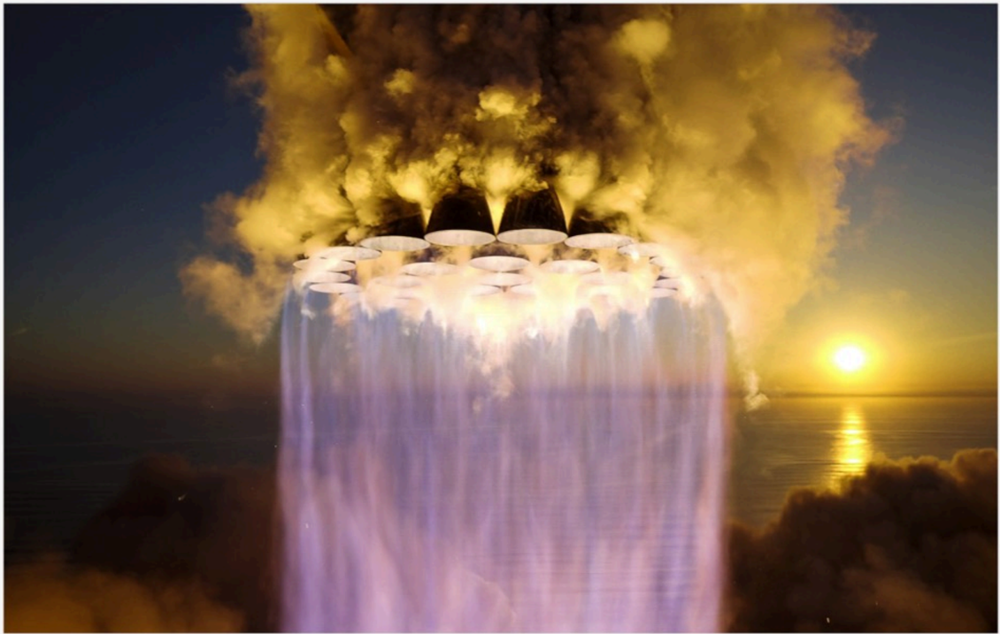

# f015 — SpaceX Super Heavy Raptor engine ignition photo

An artistic or photographic rendering of a SpaceX Super Heavy booster igniting its Raptor engines, viewed from below against a twilight horizon over water.

The image shows a bottom-up perspective of a SpaceX Super Heavy booster with multiple Raptor engines firing simultaneously, producing a massive cascade of white and violet exhaust plume. The foreground is dominated by the engine cluster and billowing exhaust clouds that spill outward and downward. The background reveals a sunset or sunrise sky over what appears to be an ocean or coastal horizon, with cloud layers visible. The image appears to be a high-fidelity rendering or dramatic photograph emphasizing the scale and visual spectacle of the engine ignition event.

**Entities:** SpaceX, Super Heavy, Raptor, Starship, engine ignition, booster

