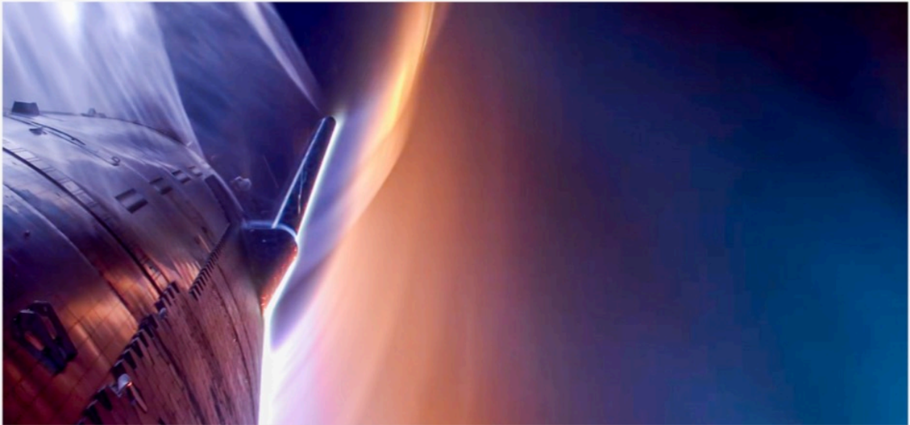

# f016 — SpaceX spacecraft atmospheric reentry artistic render photo

A dramatic artistic render shows a SpaceX vehicle ascending or reentering near Earth's upper atmosphere, with glowing orange atmospheric haze and deep blue-black space in the background.

The image is a cinematic artistic photograph or render depicting a large spacecraft (appearing to be Starship or a similar vehicle) silhouetted against a vivid gradient of deep blue-black space transitioning to a glowing orange atmospheric limb. The vehicle occupies the left side of the frame in near-silhouette, suggesting an ascent or reentry trajectory. The atmospheric glow dominates the right portion, evoking high-velocity flight through the upper atmosphere. No axes, labels, or data are present; this is a visual/promotional image.

**Entities:** SpaceX, Starship, reentry, ascent, Earth atmosphere, spacecraft, rocket

