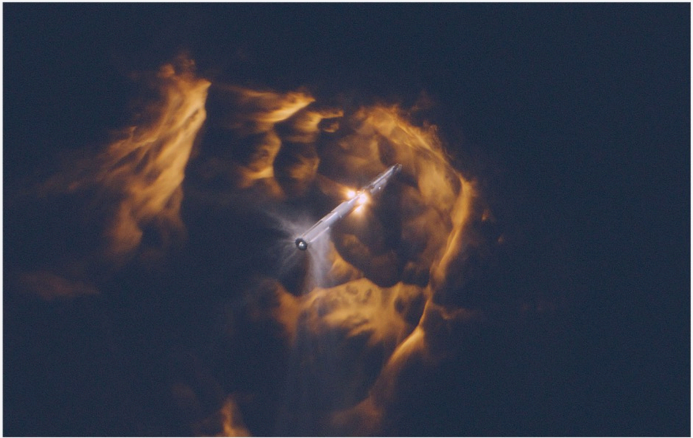

# f017 — SpaceX rocket launch dramatic sky photo

A dramatic aerial or ground-level photo capturing a rocket ascending through glowing orange and golden cloud formations, with the vehicle and its exhaust plume visible at center.

The image is a full-color photograph showing a rocket mid-ascent surrounded by dramatically illuminated clouds in deep orange, gold, and dark tones. The rocket and its bright exhaust plume appear at the center of the frame, breaking through the cloud layer. The dark sky and billowing clouds create a high-contrast composition that emphasizes the scale and power of the launch. No axes, legends, or data labels are present; the image is purely photographic.

**Entities:** SpaceX, rocket launch, launch vehicle, exhaust plume, clouds

