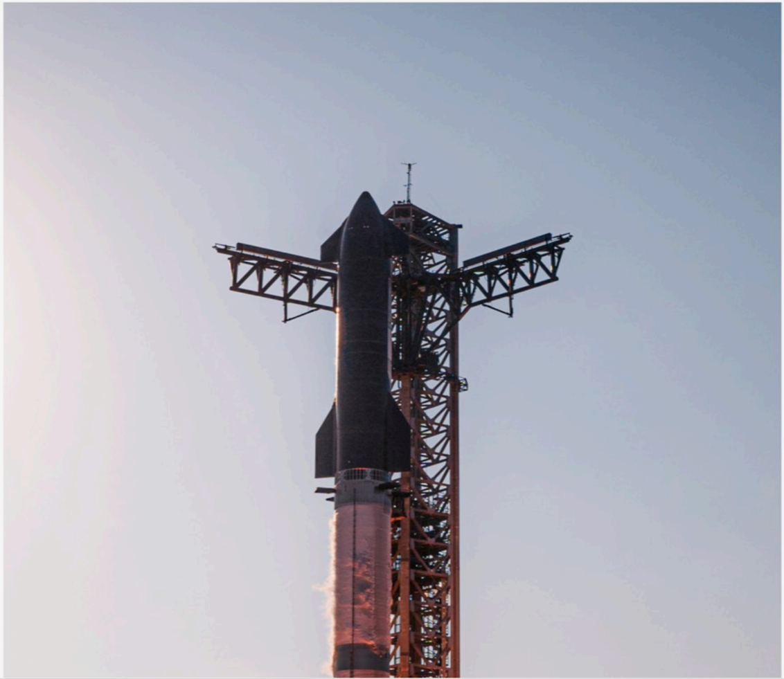

# f019 — SpaceX Starship integrated vehicle on orbital launch mount photo

A photograph of the fully integrated SpaceX Starship vehicle — comprising the Super Heavy booster and Starship upper stage — mounted on the orbital launch tower at Starbase, showcasing the vehicle's scale relative to the surrounding launch infrastructure.

The image is a portrait-orientation photograph taken from below and slightly to the side, looking up at the full Starship stack (Super Heavy booster topped by the Starship second stage with its black nosecone) held within the launch tower structure. The mechanical arms of the Mechazilla (Quick Disconnect/catch arm assembly) extend outward from the tower on both sides of the vehicle. The sky is overcast and hazy gray, providing a stark backdrop that emphasizes the rocket's height. No axes, series, or quantitative data are present; the photo serves as a visual representation of the integrated launch system.

**Entities:** SpaceX, Starship, Super Heavy, Starbase, Boca Chica, Orbital Launch Mount, Mechazilla, launch tower, Quick Disconnect arms, integrated vehicle

