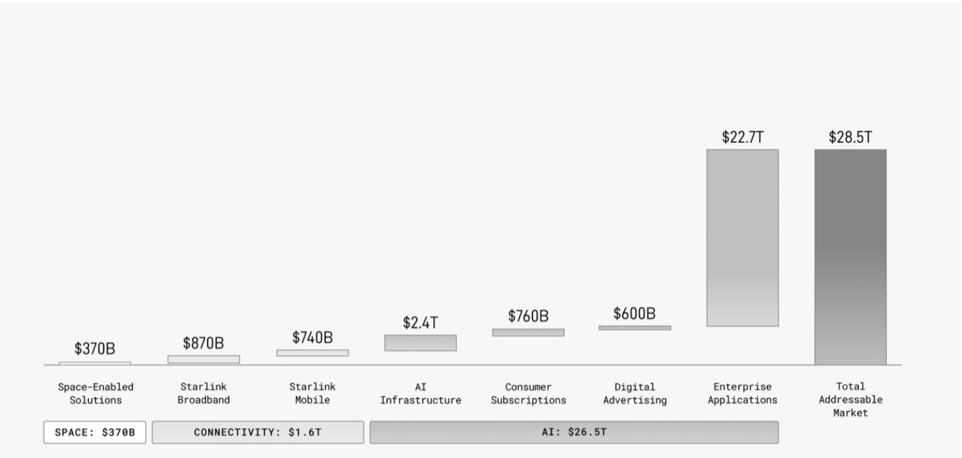

# f020 — SpaceX Estimated TAM by Segment Bar Chart $28.5T Total

The chart breaks SpaceX's estimated total addressable market into seven segments across three categories — Space, Connectivity, and AI — with Enterprise Applications alone accounting for $22.7T of the $28.5T total.

A horizontal bar chart plots seven market segments by dollar size, grouped at the bottom into three super-categories: Space ($370B), Connectivity ($1.6T), and AI ($26.5T). Each bar is labeled with its value above. Enterprise Applications at $22.7T towers over all other segments, making the AI category ($26.5T) the overwhelmingly dominant driver of the $28.5T total addressable market shown in the rightmost summary bar. Connectivity's two segments (Starlink Broadband $870B, Starlink Mobile $740B) and the Space segment ($370B) are comparatively small against the AI opportunity.

| field | value |
|---|---|
| Space-Enabled Solutions | $370B |
| Starlink Broadband | $870B |
| Starlink Mobile | $740B |
| AI Infrastructure | $2.4T |
| Consumer Subscriptions | $760B |
| Digital Advertising | $600B |
| Enterprise Applications | $22.7T |
| Total Addressable Market | $28.5T |
| SPACE category total | $370B |
| CONNECTIVITY category total | $1.6T |
| AI category total | $26.5T |

**Entities:** SpaceX, Starlink, Starlink Broadband, Starlink Mobile, AI Infrastructure, Enterprise Applications, Consumer Subscriptions, Digital Advertising, TAM, Total Addressable Market, Space-Enabled Solutions

