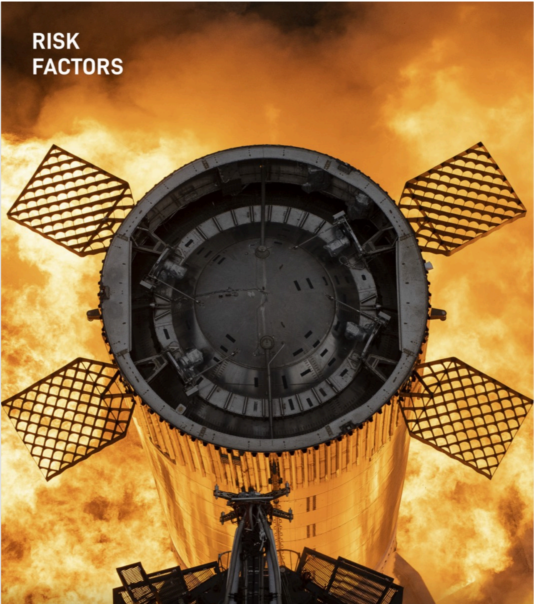

# f021 — SpaceX Risk Factors section divider — rocket in flames aerial photo

A top-down aerial photograph of a SpaceX rocket booster surrounded by fire and exhaust, used as the section-divider image for the 'Risk Factors' chapter of the SpaceX S-1 filing.

The image is a dramatic overhead shot looking down at the top of a large rocket booster, likely a SpaceX Super Heavy or similar vehicle, with four grid-fin flaps extended outward symmetrically. The rocket is engulfed in bright orange and yellow flames or exhaust plumes. The text 'RISK FACTORS' appears in white in the upper-left corner, indicating this is a section-header page within the S-1 prospectus document.

**Entities:** SpaceX, Risk Factors, Super Heavy, Starship, grid fins, booster, S-1, rocket, launch

