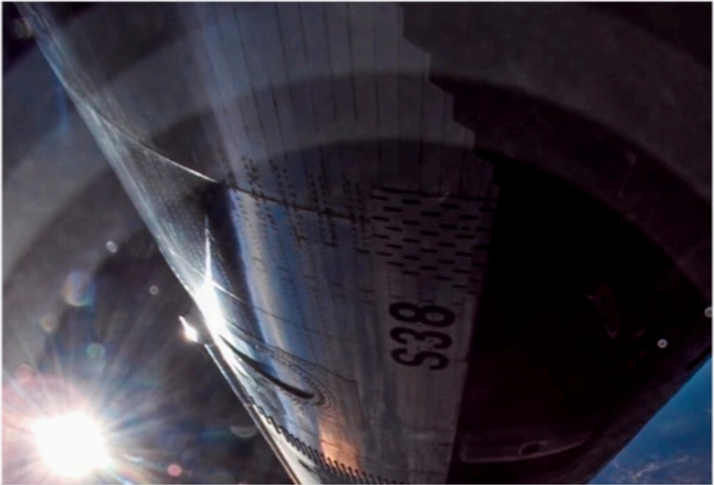

# f022 — SpaceX S38 rocket vehicle exterior photo in flight

An onboard camera photo of the SpaceX rocket vehicle body labeled "S38" captured during flight, showing the vehicle's cylindrical fuselage against a dark sky with a bright light source visible.

The image is a close-up onboard photographic shot of a large cylindrical rocket or spacecraft fuselage, with the vehicle identifier "S38" stenciled prominently on the surface. The camera appears to be mounted on the exterior of the vehicle, capturing the curved body at an oblique angle. A bright lens-flare light source—likely the sun or engine plume—is visible in the lower-left corner. The background is dark, consistent with high-altitude or near-space flight conditions.

**Entities:** SpaceX, S38, rocket, spacecraft, fuselage, onboard camera

