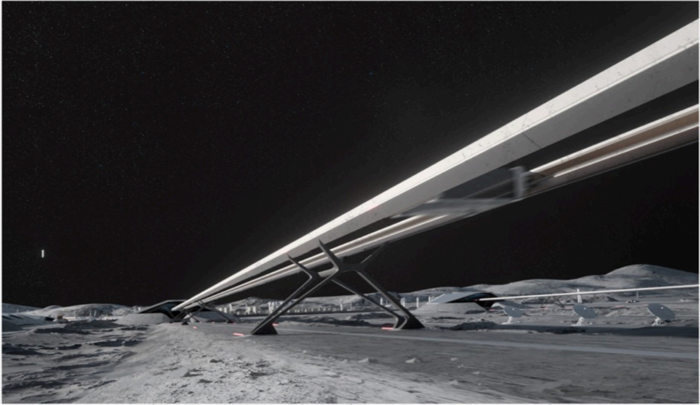

# f023 — Lunar surface mass driver or rail launch system concept rendering

An artist's rendering depicts a large linear electromagnetic launch rail or mass driver structure on the lunar surface, illustrating SpaceX's or a related entity's vision for lunar infrastructure.

The image is a photorealistic concept rendering showing an elongated elevated linear structure—likely a mass driver, electromagnetic launch rail, or linear accelerator—stretching across the lunar surface into the distance. The structure is mounted on a series of support pylons above the regolith. The scene is set in the lunar night or deep shadow with a black starless sky, and a faint crescent body (Earth or Moon) is faintly visible in the upper left background. No axes or data series are present; this is a purely illustrative concept image.

**Entities:** lunar surface, mass driver, electromagnetic launch system, rail launch, Moon, lunar infrastructure, concept rendering, linear accelerator

