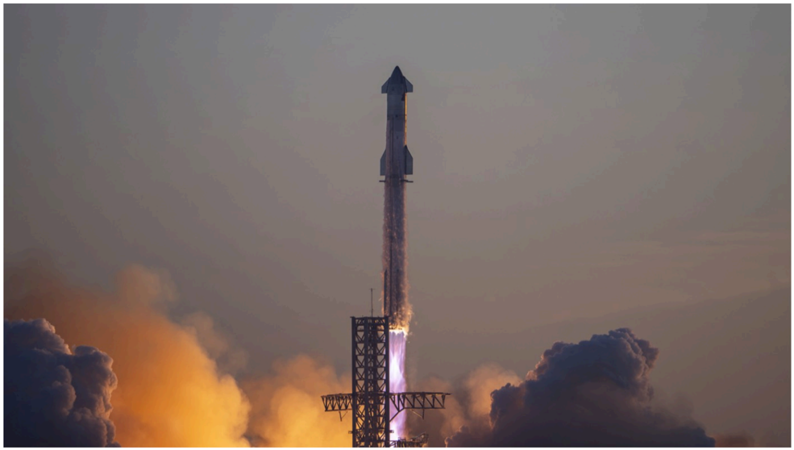

# f024 — SpaceX Starship Super Heavy rocket launch flight test photo

A launch photograph of SpaceX's Starship/Super Heavy vehicle lifting off from the launch mount, showing the vehicle ascending through large exhaust plumes at apparent dawn or dusk.

The image is a dramatic wide-angle launch photo of SpaceX's fully stacked Starship vehicle — the Super Heavy booster with the Starship upper stage on top — rising from its launch mount. Bright engine exhaust and flame are visible at the base of the booster, with massive clouds of white and orange smoke billowing outward. The orbital launch mount and tower structure are partially visible to the right. The background sky has a warm orange-red hue consistent with a dawn or dusk launch window.

**Entities:** SpaceX, Starship, Super Heavy, Starbase, Boca Chica, orbital launch mount, flight test, IFT

