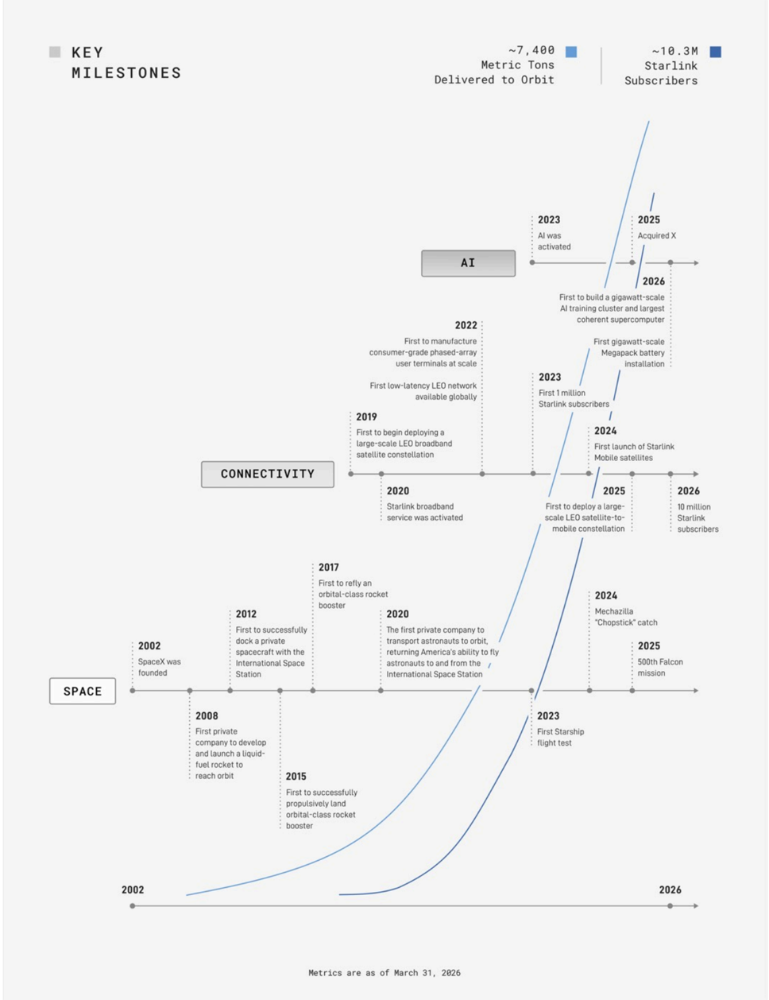

# f025 — SpaceX Key Milestones Timeline 2002–2026: 10.3M Starlink Subscribers

A three-track milestone timeline spanning Space, Connectivity, and AI from SpaceX's 2002 founding through 2026, showing exponential growth culminating in ~7,400 metric tons delivered to orbit and ~10.3M Starlink subscribers.

The figure is a vertical timeline from 2002 to 2026 with three labeled horizontal tracks—Space, Connectivity, and AI—each annotated with dated 'industry-first' achievements. An exponential growth curve (likely Starlink subscriber trajectory) rises steeply from ~2020 onward and anchors the visual. The Space track records launch and landing firsts from SpaceX's founding through the 500th Falcon mission and Mechazilla chopstick catch. The Connectivity track documents Starlink's build-out from first constellation deployment (2019) through 10 million subscribers (2026). The AI track begins with AI activation in 2023 and ends with a gigawatt-scale AI training cluster and Megapack battery installation in 2026.

| field | value |
|---|---|
| Metric Tons Delivered to Orbit | ~7,400 |
| Starlink Subscribers | ~10.3M |
| Starlink Subscribers (first milestone year) | 1 million (2023) |
| Starlink Subscribers (2026) | 10 million |
| Falcon missions milestone | 500th (2025) |

**Entities:** SpaceX, Starlink, Falcon, Starship, Mechazilla, International Space Station, LEO, Megapack, xAI, X, phased array, satellite constellation, gigawatt-scale, supercomputer, Starlink Mobile

