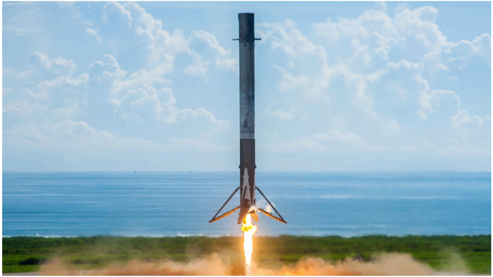

# f026 — SpaceX Falcon 9 First Stage Booster Powered Landing photo

A SpaceX Falcon 9 first stage booster completes a powered propulsive landing with legs deployed, showing the vehicle moments before touchdown against a coastal backdrop.

The photograph captures a SpaceX Falcon 9 first stage booster during the final seconds of its autonomous landing sequence, with all four deployable landing legs fully extended. The Merlin engine is firing at the base, producing a bright exhaust plume against the ground. The booster is oriented vertically with ocean or coastal water visible in the background beneath a partly cloudy blue sky. No launch infrastructure or landing pad markings are discernible at this angle.

**Entities:** SpaceX, Falcon 9, first stage booster, Merlin engine, landing legs, propulsive landing, reusable rocket, RTLS

