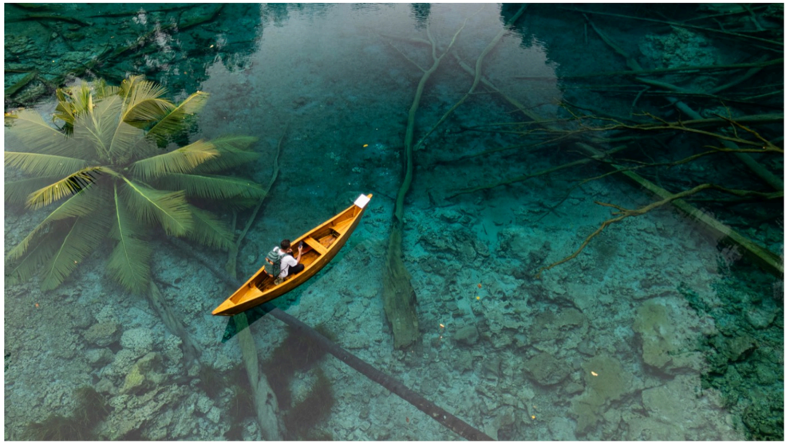

# f027 — Aerial photo person orange kayak crystal-clear tropical water

An overhead aerial photograph showing a person paddling an orange kayak or canoe through exceptionally clear, shallow tropical water surrounded by trees.

The image is an aerial/bird's-eye photograph showing a single person in a bright orange kayak navigating what appears to be a spring-fed river or cenote with extraordinarily transparent water. The water is a vivid turquoise-green and so clear that the sandy or rocky bottom is fully visible beneath the hull. Palm trees and bare-branched trees frame the scene on the left and upper edges. There are no axes, series, labels, or data elements; this is a nature photograph.

**Entities:** kayak, aerial photography, clear water, tropical, spring river, cenote, palm trees

