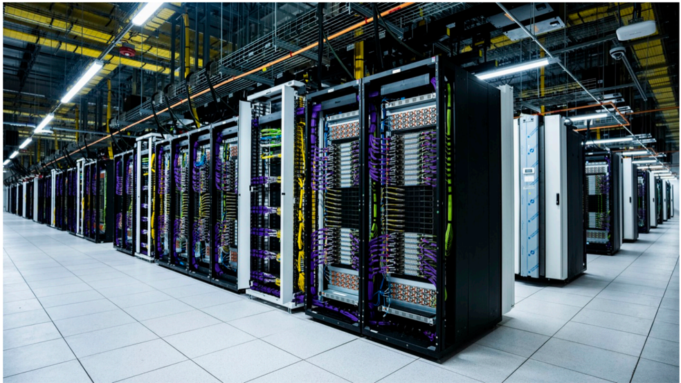

# f028 — Colossus II data center facility Memphis Tennessee photo

The figure shows the interior of xAI's Colossus II supercomputer facility in Memphis, Tennessee, depicting long rows of densely packed server racks with colorful cable bundles running overhead and along the aisles.

The photograph captures a wide-angle view down a central aisle of a large-scale data center, with tall black server racks extending the full length of the frame on both sides. Dense bundles of cables — predominantly purple, yellow, and green — run overhead and along the rack columns, indicating high-density interconnect infrastructure. Overhead fluorescent lighting illuminates a white-tiled raised floor, consistent with enterprise-grade hyperscale compute facilities. No text overlays or axis labels are present; the image is a documentary photograph of physical infrastructure.

**Entities:** Colossus II, Memphis, Tennessee, xAI, data center, server racks, supercomputer, HPC facility

