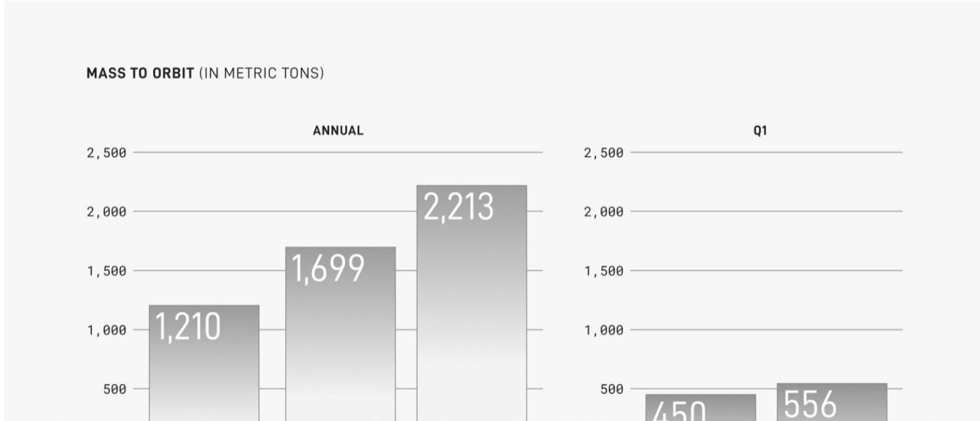

# f029 — SpaceX Mass to Orbit Annual and Q1 bar chart 2,213 metric tons

This figure shows SpaceX's mass delivered to orbit in metric tons across annual periods and Q1, revealing consistent year-over-year growth reaching 2,213 metric tons annually.

The left panel shows annual mass to orbit (in metric tons) with three bars rising from 1,210 to 1,699 to 2,213. The right panel shows Q1 mass to orbit with two bars at 450 and 556 metric tons. Both panels share a y-axis scale up to 2,500 metric tons. The year labels on the x-axis are cut off in the image and cannot be read.

| field | value |
|---|---|
| Annual mass to orbit — year 1 (metric tons) | 1,210 |
| Annual mass to orbit — year 2 (metric tons) | 1,699 |
| Annual mass to orbit — year 3 (metric tons) | 2,213 |
| Q1 mass to orbit — period 1 (metric tons) | 450 |
| Q1 mass to orbit — period 2 (metric tons) | 556 |

**Entities:** SpaceX, mass to orbit, metric tons, LEO, orbital launch, payload

