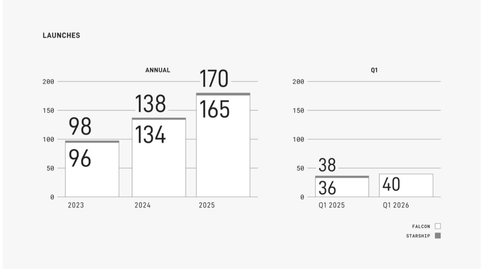

# f030 — SpaceX Launches Annual and Q1 bar chart 170 total in 2025

This figure shows SpaceX Falcon and Starship launch counts annually (2023–2025) and for Q1 (Q1 2025 vs. Q1 2026), revealing consistent year-over-year growth with 2025 reaching 170 total launches.

The left panel shows annual launch totals broken into Falcon (white bar, lower number) and Starship (dark cap, incremental difference) for 2023, 2024, and 2025. The right panel shows Q1 launch totals for Q1 2025 and Q1 2026 using the same Falcon/Starship split. Annual launches grew from 98 in 2023 to 138 in 2024 to 170 in 2025, while Q1 launches rose from 38 in Q1 2025 to 40 in Q1 2026.

| field | value |
|---|---|
| Annual launches 2023 (Falcon) | 96 |
| Annual launches 2023 (total) | 98 |
| Annual launches 2024 (Falcon) | 134 |
| Annual launches 2024 (total) | 138 |
| Annual launches 2025 (Falcon) | 165 |
| Annual launches 2025 (total) | 170 |
| Q1 2025 launches (Falcon) | 36 |
| Q1 2025 launches (total) | 38 |
| Q1 2026 launches | 40 |

**Entities:** SpaceX, Falcon, Starship, launches, 2023, 2024, 2025, Q1 2025, Q1 2026

