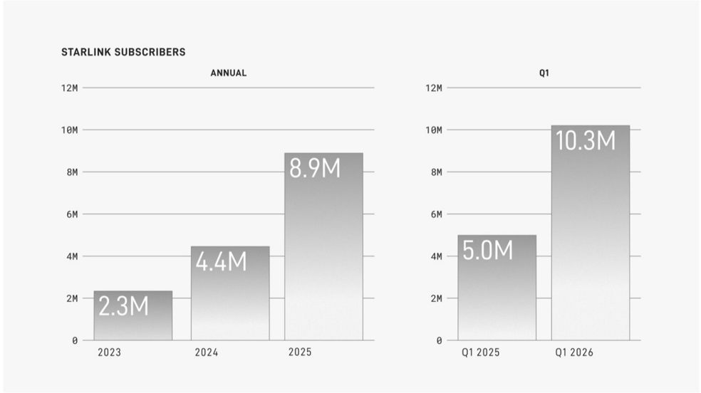

# f031 — Starlink Subscribers Annual and Q1 bar chart 10.3M

Two bar charts show Starlink subscriber counts annually (2023–2025) and for Q1 comparisons (Q1 2025 vs. Q1 2026), revealing rapid growth from 2.3M to 10.3M subscribers.

The left chart plots annual Starlink subscriber totals for 2023, 2024, and 2025, with the Y-axis scaled to 12M. The right chart compares Q1 2025 to Q1 2026 on the same scale. Both charts show steep growth: annual subscribers nearly quadrupled from 2.3M in 2023 to 8.9M in 2025, while Q1 2026 (10.3M) more than doubled Q1 2025 (5.0M), indicating accelerating year-over-year momentum.

| field | value |
|---|---|
| Annual Subscribers 2023 | 2.3M |
| Annual Subscribers 2024 | 4.4M |
| Annual Subscribers 2025 | 8.9M |
| Q1 2025 Subscribers | 5.0M |
| Q1 2026 Subscribers | 10.3M |

**Entities:** Starlink, SpaceX, satellite internet, subscribers

