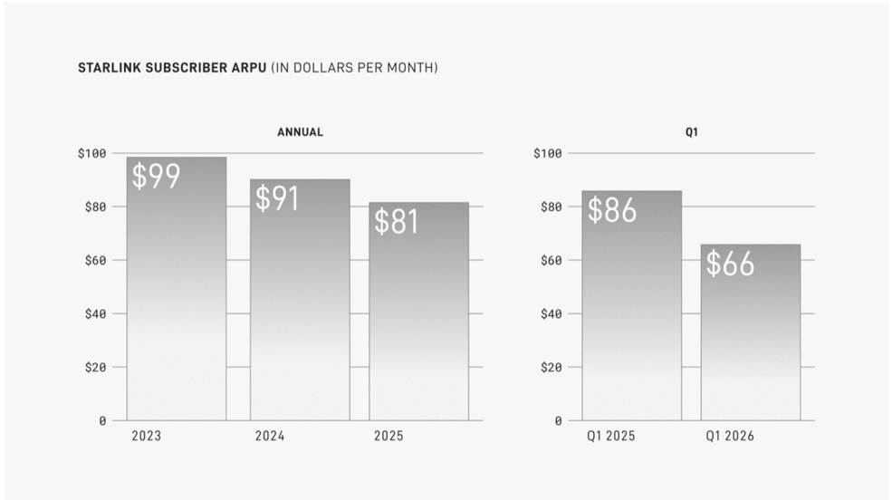

# f032 — Starlink Subscriber ARPU bar chart declining $99 to $81 annually

Starlink subscriber average revenue per user (ARPU) has declined steadily from $99/month in 2023 to $81/month in full-year 2025, with Q1 2026 ARPU falling sharply to $66/month versus $86 in Q1 2025.

Two side-by-side bar charts track Starlink subscriber ARPU in dollars per month. The left chart ('Annual') shows full-year ARPU for 2023, 2024, and 2025, with bars declining from $99 to $91 to $81. The right chart ('Q1') compares Q1 2025 ($86) to Q1 2026 ($66), a year-over-year drop of $20. Both series confirm a consistent downward trend in per-subscriber monthly revenue, likely reflecting mix shift toward lower-priced plans or geographies.

| field | value |
|---|---|
| Annual ARPU 2023 ($/month) | 99 |
| Annual ARPU 2024 ($/month) | 91 |
| Annual ARPU 2025 ($/month) | 81 |
| Q1 2025 ARPU ($/month) | 86 |
| Q1 2026 ARPU ($/month) | 66 |

**Entities:** Starlink, ARPU, average revenue per user, SpaceX, satellite internet

