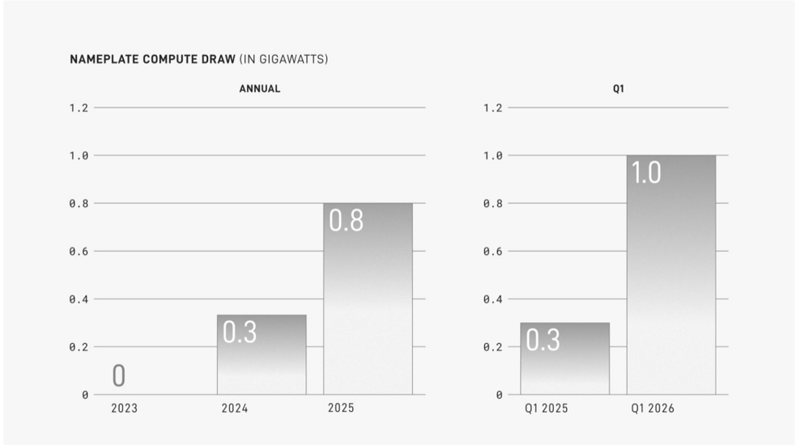

# f033 — Nameplate Compute Draw Annual & Q1 bar chart up to 1.0 GW

SpaceX's nameplate compute power draw has grown rapidly, reaching 0.8 GW annually in 2025 and 1.0 GW in Q1 2026 alone.

Two bar charts display nameplate compute draw in gigawatts. The left chart shows annual figures: 0 GW in 2023, 0.3 GW in 2024, and 0.8 GW in 2025, indicating rapid year-over-year growth. The right chart shows Q1 snapshots: 0.3 GW in Q1 2025 rising to 1.0 GW in Q1 2026, a more than 3× increase in a single year. Together the charts signal accelerating compute infrastructure build-out, with Q1 2026 already exceeding the full-year 2025 figure.

| field | value |
|---|---|
| Annual Nameplate Compute Draw 2023 (GW) | 0 |
| Annual Nameplate Compute Draw 2024 (GW) | 0.3 |
| Annual Nameplate Compute Draw 2025 (GW) | 0.8 |
| Q1 2025 Nameplate Compute Draw (GW) | 0.3 |
| Q1 2026 Nameplate Compute Draw (GW) | 1.0 |

**Entities:** SpaceX, nameplate compute draw, gigawatts, GW, 2023, 2024, 2025, Q1 2025, Q1 2026

