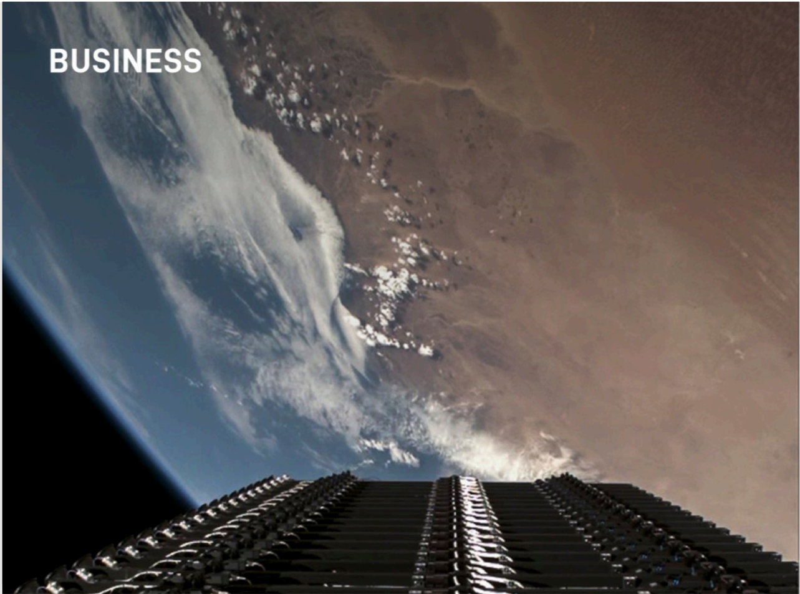

# f034 — Business section header photo — Earth from orbit with spacecraft

A section-header photograph showing Earth's curved horizon from orbit, with a spacecraft or satellite structure in the foreground, marking the start of the Business section.

The image is a full-bleed orbital photograph used as a section divider. Earth's surface and cloud cover are visible curving along the horizon, viewed from low Earth orbit. In the lower foreground, a dark structured object — consistent with a satellite or spacecraft solar panel array — frames the bottom of the shot. The word 'BUSINESS' is overlaid in bold white text at the upper left, indicating this is the opening page of the Business section of the document.

**Entities:** SpaceX, Business, Earth, orbit, satellite, spacecraft, low Earth orbit, solar panels

