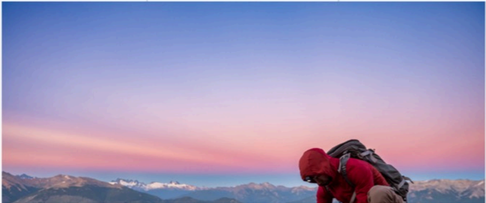

# f035 — Mountaineer at summit during twilight — SpaceX S-1 inspirational photo

A hiker in a red jacket crouches at a mountain summit against a pink-purple twilight sky, used as an inspirational image in the SpaceX S-1 filing.

The photograph shows a lone mountaineer wearing a red jacket and carrying a large backpack, bent forward at what appears to be a high-altitude summit. The background features a sweeping panorama of mountain ridgelines under a gradient sky transitioning from deep blue at the top to pink and purple near the horizon, indicating either sunrise or sunset. The image contains no data, axes, or labels, and functions as a full-bleed inspirational visual within the document.

**Entities:** SpaceX, S-1, mountaineer, mountain summit, twilight, hiker

