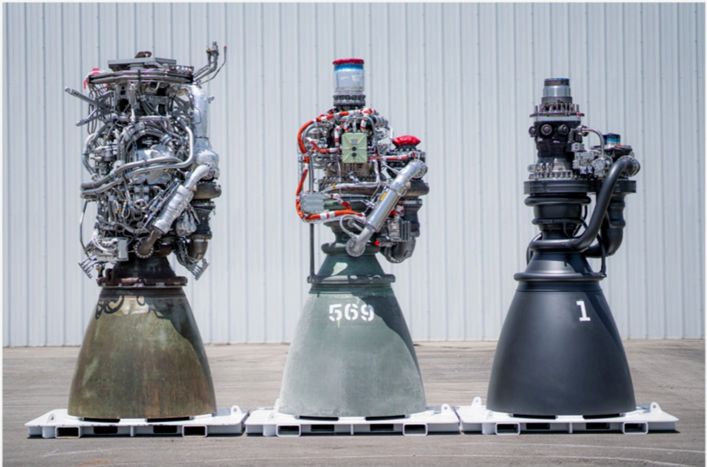

# f036 — SpaceX Three Rocket Engines Side-by-Side Comparison Photo

The figure shows three SpaceX rocket engines displayed side by side outdoors, illustrating differences in size, design, and configuration across engine generations or variants.

Three rocket engines are arranged side by side on pallets in front of a white industrial building. The left engine features a metallic gold/bronze nozzle bell with a complex turbomachinery assembly on top. The center engine, labeled '568', has a teal/green-colored body with extensive plumbing and a silver nozzle. The right engine, labeled '1', is the largest and darkest, with a black nozzle bell and a more compact upper section, suggesting it is a newer or different variant.

**Entities:** SpaceX, rocket engine, Merlin, Raptor, nozzle, turbopump, Falcon 9, Starship, 568, engine serial number

