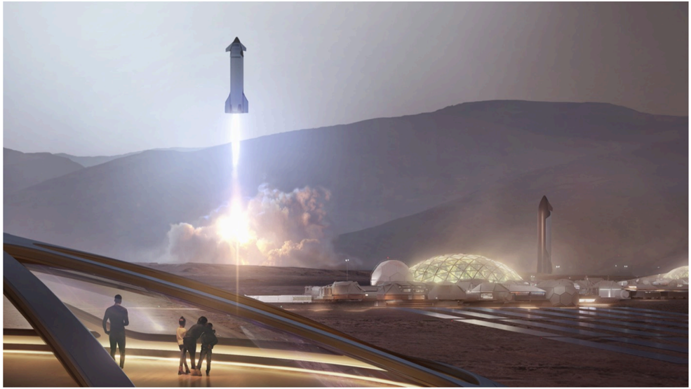

# f037 — Artist Visualization of SpaceX Starship Launch at Mars Colony

An artist's rendering depicting a future human settlement on Mars, showing a Starship vehicle launching while two figures observe from a foreground walkway amid habitat domes.

The image is an artist's conceptual visualization of a Mars surface colony. In the background, a SpaceX Starship vehicle lifts off with a bright exhaust plume against a hazy Martian sky and rocky hills. Mid-ground shows multiple dome-shaped habitat structures. Two human silhouettes stand in the foreground on a flat surface, suggesting an established base with infrastructure.

**Entities:** SpaceX, Starship, Mars, Mars colony, habitat domes, human settlement, interplanetary

