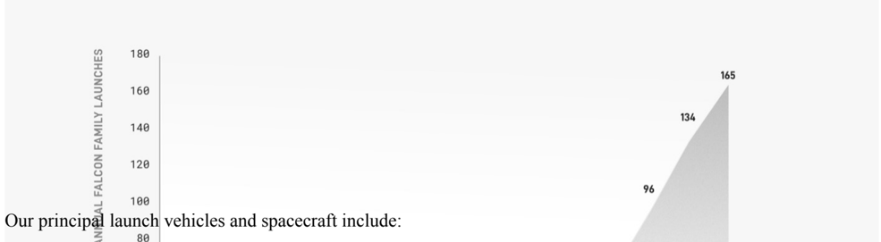

# f038 — Falcon Family Annual Launches bar chart — 165 launches peak

The chart shows annual Falcon family launch counts over multiple years, with a clear upward trend reaching a peak of 165 launches.

The y-axis is labeled 'ANNUAL FALCON FAMILY LAUNCHES' and runs from approximately 80 to 180. Three data point labels are visible on the chart: 96, 134, and 165, indicating successive years of launch totals. The chart uses a filled area or bar style and shows a strong upward growth trend. The x-axis (year labels) is not legible in the visible crop of the image.

| field | value |
|---|---|
| Annual Falcon Family Launches (year ~1) | 96 |
| Annual Falcon Family Launches (year ~2) | 134 |
| Annual Falcon Family Launches (year ~3) | 165 |

**Entities:** Falcon, SpaceX, Falcon family, annual launches

