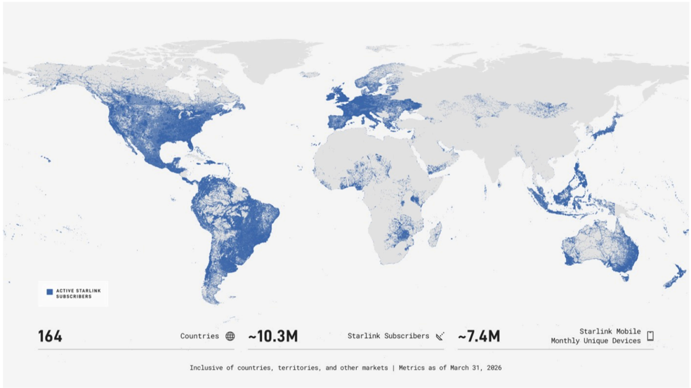

# f039 — Starlink Global Subscriber Base Map — 164 Countries, ~10.3M Subscribers

A world map showing the geographic distribution of active Starlink subscribers across 164 countries as of March 31, 2026, with ~10.3M total subscribers and ~7.4M Starlink Mobile monthly unique devices.

The figure is a dot-density world map where blue shading represents active Starlink subscriber concentrations. Coverage is heaviest across North America, Europe, Brazil, and Australia, with lighter penetration across Africa, the Middle East, and parts of Asia. Three headline metrics are displayed below the map: 164 countries/territories served, approximately 10.3 million Starlink subscribers, and approximately 7.4 million Starlink Mobile monthly unique devices. All metrics are as of March 31, 2026.

| field | value |
|---|---|
| Countries (incl. territories and other markets) | 164 |
| Starlink Subscribers | ~10.3M |
| Starlink Mobile Monthly Unique Devices | ~7.4M |

**Entities:** Starlink, SpaceX, satellite internet, Starlink Mobile, subscriber base, global coverage, LEO broadband

