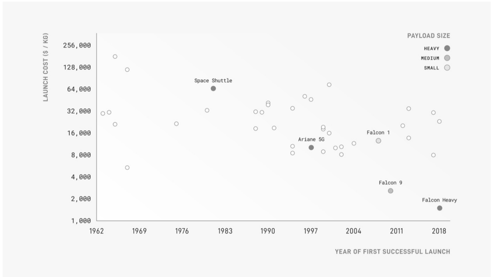

# f040 — Falcon Heavy Falcon 9 Space Shuttle LEO launch cost scatter 1962–2018

The chart plots the cost per kilogram to reach low Earth orbit (constant 2021 dollars) for rocket vehicles from 1962 to 2018, showing SpaceX's Falcon 9 and Falcon Heavy as the lowest-cost vehicles ever flown.

The x-axis shows year of first successful launch (1962–2018) and the y-axis shows launch cost in constant 2021 $/kg on a logarithmic scale from approximately $1,000 to $256,000. Each dot is a launch vehicle, with dot size encoding payload class (heavy, medium, small). Costs are broadly elevated and noisy from the 1960s through the 2000s, with the Space Shuttle standing out at ~$64,000/kg around 1981. SpaceX's Falcon 9 (~2010) and Falcon Heavy (2018) anchor the bottom of the chart, with Falcon Heavy falling between the $1,000 and $2,000 gridlines—the lowest cost shown.

| field | value |
|---|---|
| Space Shuttle launch cost ($/kg) | 64,000 |
| Falcon Heavy launch cost ($/kg, ~2018) | ~1,500 |
| Falcon 9 launch cost ($/kg, ~2010) | ~2,700 |
| Falcon 1 launch cost ($/kg, ~2008) | ~12,000 |
| Ariane 5G launch cost ($/kg, ~1997) | ~10,000 |
| Y-axis gridline ($/kg) | 256,000 |
| Y-axis gridline ($/kg) | 128,000 |
| Y-axis gridline ($/kg) | 64,000 |
| Y-axis gridline ($/kg) | 32,000 |
| Y-axis gridline ($/kg) | 16,000 |
| Y-axis gridline ($/kg) | 8,000 |
| Y-axis gridline ($/kg) | 4,000 |
| Y-axis gridline ($/kg) | 2,000 |
| Y-axis gridline ($/kg) | 1,000 |

**Entities:** Falcon Heavy, Falcon 9, Falcon 1, Space Shuttle, Ariane 5G, SpaceX, low Earth orbit, LEO, launch cost, payload size, $/kg, constant 2021 dollars

