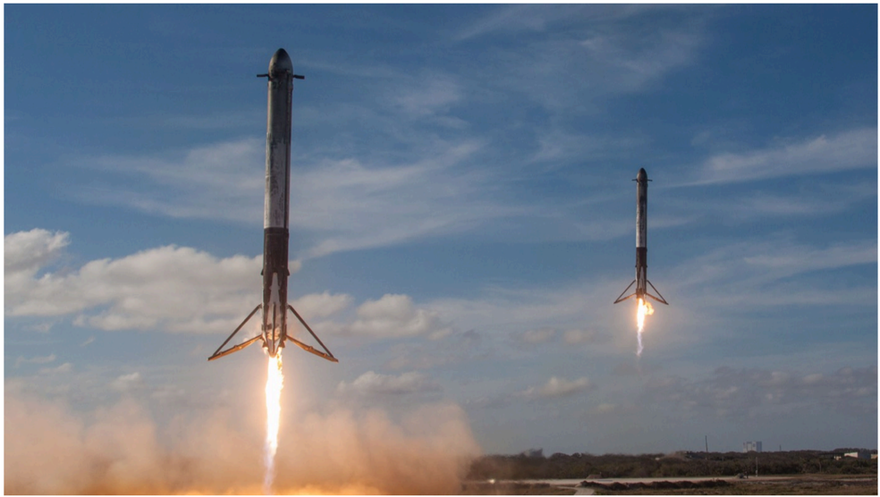

# f041 — SpaceX Falcon Heavy dual booster simultaneous landing photo

The photograph shows two SpaceX Falcon Heavy side boosters performing a simultaneous propulsive landing, visually illustrating the reusability breakthrough that dramatically reduced launch costs.

The image is a wide-angle photograph capturing two SpaceX Falcon 9-derived side boosters mid-touchdown, engines firing with bright plumes against a partly cloudy blue sky. Both boosters descend in parallel with landing legs deployed, demonstrating synchronized recovery. The scene appears to be at a land-based landing zone, consistent with Cape Canaveral Landing Zones 1 and 2 used for Falcon Heavy missions. The visual context supports the surrounding S-1 narrative about reusability-driven cost reduction.

**Entities:** SpaceX, Falcon Heavy, Falcon 9, booster landing, reusable rocket, Cape Canaveral, Landing Zone 1, Landing Zone 2, propulsive landing, launch cost reduction

