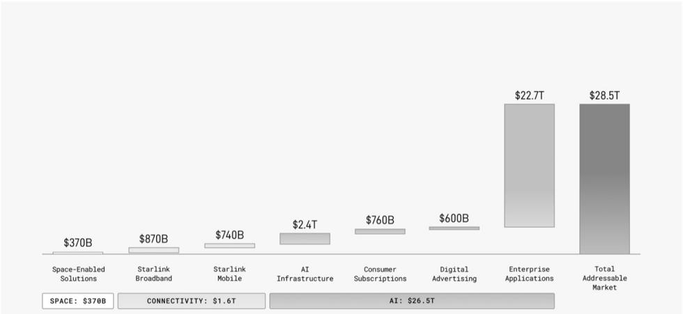

# f042 — SpaceX TAM $28.5T: Space, Connectivity, AI bar chart

This bar chart breaks down SpaceX's total addressable market of $28.5T across space, connectivity, and AI segments, with enterprise applications ($22.7T) dominating the AI category.

The horizontal axis lists eight market segments grouped into three categories: Space ($370B), Connectivity ($1.6T), and AI ($26.5T). The vertical axis represents market size in dollars. Individual bars show Space-Enabled Solutions at $370B, Starlink Broadband at $870B, Starlink Mobile at $740B, AI Infrastructure at $2.4T, Consumer Subscriptions at $760B, Digital Advertising at $600B, and Enterprise Applications at $22.7T. The final bar aggregates all segments into a Total Addressable Market of $28.5T, with Enterprise Applications overwhelmingly driving the total.

| field | value |
|---|---|
| Space-Enabled Solutions ($) | $370B |
| Starlink Broadband ($) | $870B |
| Starlink Mobile ($) | $740B |
| AI Infrastructure ($) | $2.4T |
| Consumer Subscriptions ($) | $760B |
| Digital Advertising ($) | $600B |
| Enterprise Applications ($) | $22.7T |
| Total Addressable Market ($) | $28.5T |
| SPACE subtotal ($) | $370B |
| CONNECTIVITY subtotal ($) | $1.6T |
| AI subtotal ($) | $26.5T |

**Entities:** SpaceX, Starlink, Starlink Broadband, Starlink Mobile, Space-Enabled Solutions, AI Infrastructure, Consumer Subscriptions, Digital Advertising, Enterprise Applications, Total Addressable Market, TAM

