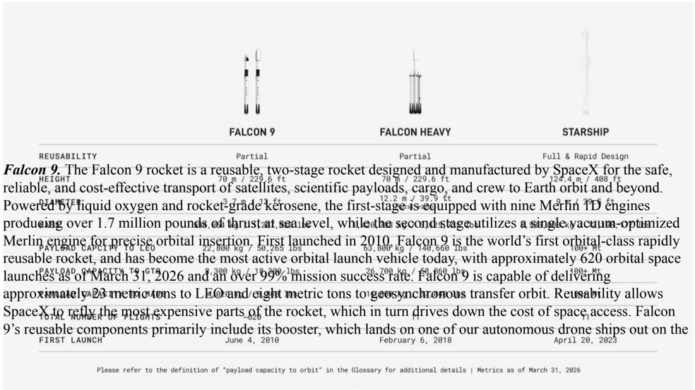

# f043 — SpaceX Falcon 9, Falcon Heavy, Starship rocket assembly comparison diagram

Figure 43 shows side-by-side scale illustrations of SpaceX's three launch vehicles — Falcon 9, Falcon Heavy, and Starship — along with a caption summarizing each vehicle's design, propulsion, and payload capabilities.

The figure presents three vertically oriented rocket illustrations labeled Falcon 9, Falcon Heavy, and Starship arranged left to right under the heading 'ASSEMBLY.' The accompanying caption describes Falcon 9 as a reusable two-stage rocket powered by liquid oxygen and rocket-grade kerosene with nine Merlin 1D engines generating over 1.7 million pounds of thrust at sea level. Falcon Heavy is described as a heavy-lift vehicle producing over 5 million pounds of thrust, and Starship is introduced as a fully reusable system capable of carrying payloads to low Earth orbit and beyond including geostationary transfer orbit. The visual scale comparison highlights the progressive size increase from Falcon 9 to Starship.

| field | value |
|---|---|
| Falcon 9 first-stage thrust at sea level (lbf) | 1.7 million |
| Falcon Heavy thrust (lbf) | 5 million |

**Entities:** SpaceX, Falcon 9, Falcon Heavy, Starship, Merlin 1D, Merlin Vacuum, LEO, geostationary transfer orbit, liquid oxygen, rocket-grade kerosene

