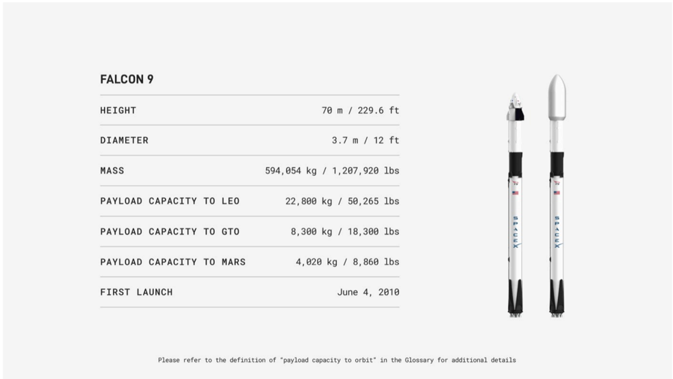

# f044 — Falcon 9 SpaceX rocket spec table: 22,800 kg LEO capacity

This figure presents the key technical specifications of the Falcon 9 rocket, showing its dimensions, mass, payload capacities to LEO/GTO/Mars, and first launch date.

The figure is a specification table for the Falcon 9 rocket, listing six parameters: height, diameter, mass, payload capacity to LEO, payload capacity to GTO, and payload capacity to Mars, each given in both metric and imperial units. Two side-by-side rocket illustrations appear on the right, depicting Falcon 9 variants (one with a Dragon capsule, one with a fairing). The data establishes the Falcon 9 as a medium-to-heavy lift vehicle capable of delivering 22,800 kg to low Earth orbit and 4,020 kg to Mars. A footnote directs readers to the Glossary for the definition of payload capacity to orbit.

| field | value |
|---|---|
| Height (m) | 70 |
| Height (ft) | 229.6 |
| Diameter (m) | 3.7 |
| Diameter (ft) | 12 |
| Mass (kg) | 594,054 |
| Mass (lbs) | 1,207,920 |
| Payload Capacity to LEO (kg) | 22,800 |
| Payload Capacity to LEO (lbs) | 50,265 |
| Payload Capacity to GTO (kg) | 8,300 |
| Payload Capacity to GTO (lbs) | 18,300 |
| Payload Capacity to Mars (kg) | 4,020 |
| Payload Capacity to Mars (lbs) | 8,860 |
| First Launch | June 4, 2010 |

**Entities:** Falcon 9, SpaceX, LEO, GTO, Mars, Dragon, low Earth orbit, geostationary transfer orbit

