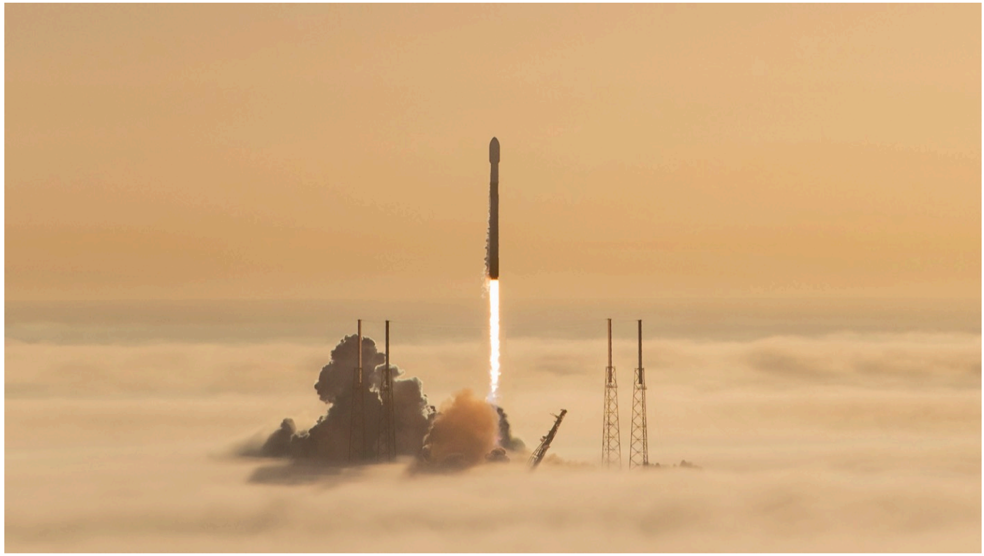

# f045 — Falcon 9 rocket launch photo ascending through cloud layer

A SpaceX Falcon 9 rocket pierces through a thick cloud layer at liftoff, with its exhaust plume glowing beneath the overcast sky.

The photograph captures a SpaceX Falcon 9 rocket in the early ascent phase, having cleared a dense cloud deck with its exhaust plume and launch infrastructure visible below. The rocket is centered in the frame, rising vertically against an orange-hued hazy sky. Launch tower structures are faintly visible through the clouds on either side of the vehicle. The image conveys the scale and drama of a coastal launch in low-visibility conditions.

**Entities:** SpaceX, Falcon 9, rocket launch, launch pad, cloud layer, exhaust plume, launch tower

