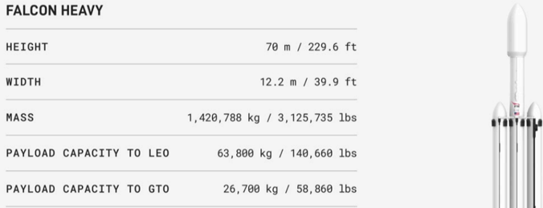

# f046 — Falcon Heavy spec table: 63,800 kg LEO payload capacity

This figure presents key technical specifications for SpaceX's Falcon Heavy rocket, highlighting its dimensions, mass, and payload capacities to LEO and GTO.

The figure is a spec table listing five physical and performance parameters for the Falcon Heavy launch vehicle. Each row gives a measurement in both metric and imperial units. The table covers height (70 m), width (12.2 m), total mass (1,420,788 kg), payload capacity to low Earth orbit (63,800 kg), and payload capacity to geostationary transfer orbit (26,700 kg). A rendering of the Falcon Heavy rocket is shown on the right side of the figure.

| field | value |
|---|---|
| Height (m) | 70 |
| Height (ft) | 229.6 |
| Width (m) | 12.2 |
| Width (ft) | 39.9 |
| Mass (kg) | 1,420,788 |
| Mass (lbs) | 3,125,735 |
| Payload Capacity to LEO (kg) | 63,800 |
| Payload Capacity to LEO (lbs) | 140,660 |
| Payload Capacity to GTO (kg) | 26,700 |
| Payload Capacity to GTO (lbs) | 58,860 |

**Entities:** Falcon Heavy, SpaceX, LEO, GTO, low Earth orbit, geostationary transfer orbit

