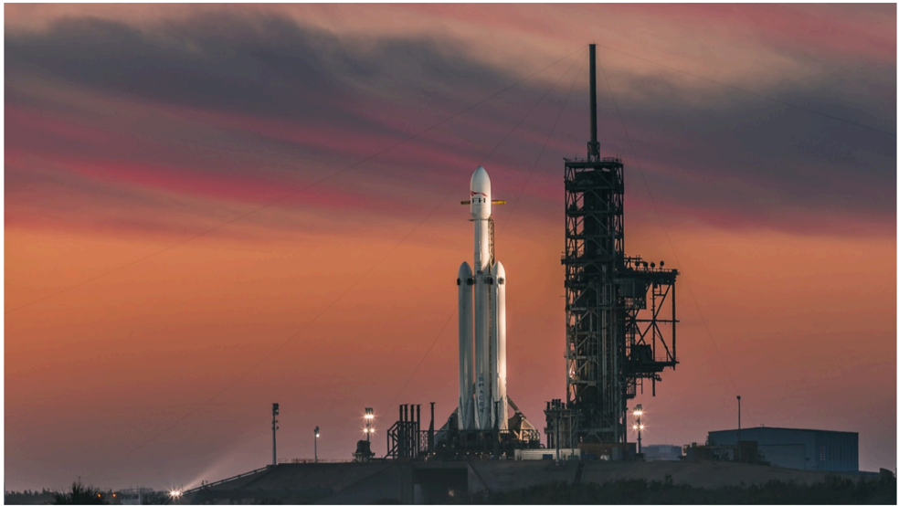

# f047 — Falcon Heavy rocket on launch pad at dusk

A SpaceX Falcon Heavy rocket stands on its launch pad against a dramatic sunset sky, showcasing the vehicle's triple-booster configuration.

The image is a wide-angle photograph of a SpaceX Falcon Heavy rocket sitting on a launch pad, likely at Kennedy Space Center. The rocket's distinctive triple-core first stage is clearly visible, with the two side boosters flanking the central core. A launch support structure/service tower stands to the right. The scene is lit by a vivid orange and purple twilight sky, suggesting either dawn or dusk conditions.

**Entities:** SpaceX, Falcon Heavy, Kennedy Space Center, launch pad, rocket booster, service tower

