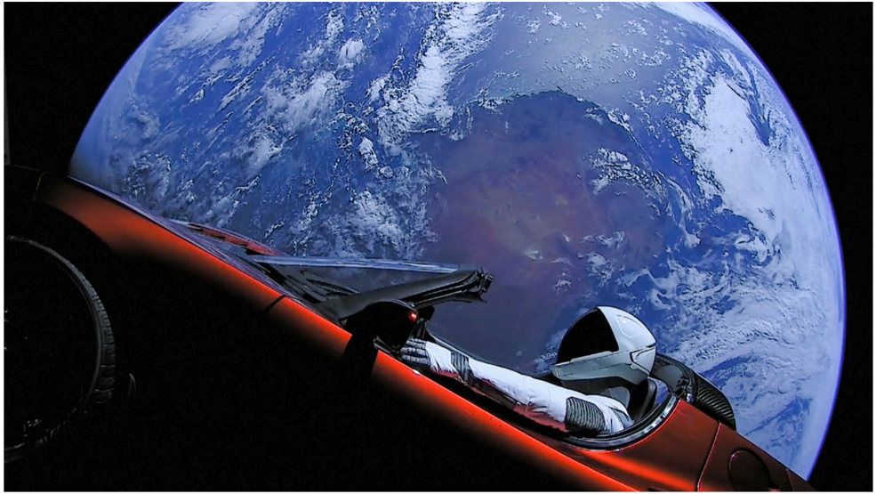

# f048 — Starman Tesla Roadster in Earth orbit — Falcon Heavy payload photo

A spacesuit-clad mannequin ("Starman") sits in Elon Musk's red Tesla Roadster in space with Earth visible in the background, serving as the demonstration payload for SpaceX's Falcon Heavy test flight.

The photograph shows a red Tesla Roadster convertible floating in low Earth orbit with a mannequin dressed in a white SpaceX spacesuit in the driver's seat. Earth's curvature, blue oceans, and white cloud cover fill the background against the black of space. The image was taken from a camera mounted on the car during the Falcon Heavy debut launch on February 6, 2018, and became an iconic image of the commercial spaceflight era.

**Entities:** Starman, Tesla Roadster, SpaceX, Falcon Heavy, Earth, low Earth orbit, spacesuit, Elon Musk

