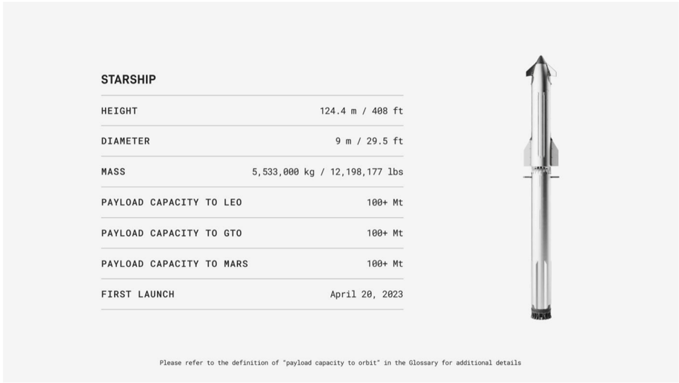

# f049 — Starship SpaceX spec table: 124.4 m height, 100+ Mt payload

This spec table presents key technical parameters for SpaceX's Starship launch vehicle, showing it stands 124.4 m tall with over 100 metric ton payload capacity to LEO, GTO, and Mars.

The figure is a specification table for the SpaceX Starship fully integrated launch system, accompanied by a rendered side-view photograph of the vehicle. Rows list physical dimensions (height, diameter, mass) and performance metrics (payload capacity to LEO, GTO, and Mars), all shown with dual metric/imperial units where applicable. All three payload destinations list the same value of 100+ Mt, indicating a common design target rather than differentiated trajectory-specific figures. A footnote directs readers to the Glossary for the precise definition of 'payload capacity to orbit.'

| field | value |
|---|---|
| Height (m) | 124.4 |
| Height (ft) | 408 |
| Diameter (m) | 9 |
| Diameter (ft) | 29.5 |
| Mass (kg) | 5,533,000 |
| Mass (lbs) | 12,198,177 |
| Payload Capacity to LEO (Mt) | 100+ |
| Payload Capacity to GTO (Mt) | 100+ |
| Payload Capacity to Mars (Mt) | 100+ |
| First Launch | April 20, 2023 |

**Entities:** SpaceX, Starship, LEO, GTO, Mars, Super Heavy, first launch, payload capacity

