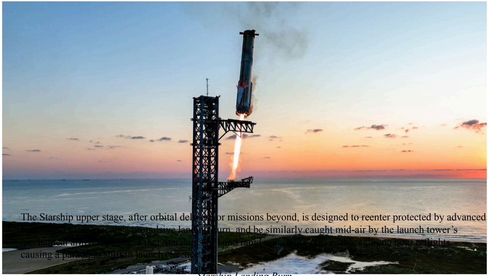

# f050 — Starship Mechazilla Launch Tower Photo SpaceX Starbase Sunset

A photograph of SpaceX's Starship vehicle on the launch mount at Starbase with the Mechazilla catch tower visible, illustrating the integrated launch-and-catch system described in the overlaid caption text.

The image is a wide-angle dusk/sunset photo taken at SpaceX's Starbase facility showing the Starship upper stage stacked on the Super Heavy booster beside the tall Mechazilla ("chopstick") launch tower. The orange-pink sky provides the backdrop. White overlay text at the bottom describes the Starship upper stage's reentry design and the tower catch system. No numerical data axes are present; the figure functions as an illustrative photo with a descriptive caption.

**Entities:** SpaceX, Starship, Super Heavy, Starbase, Mechazilla, launch tower, chopstick arms, Starship upper stage, orbital reentry

