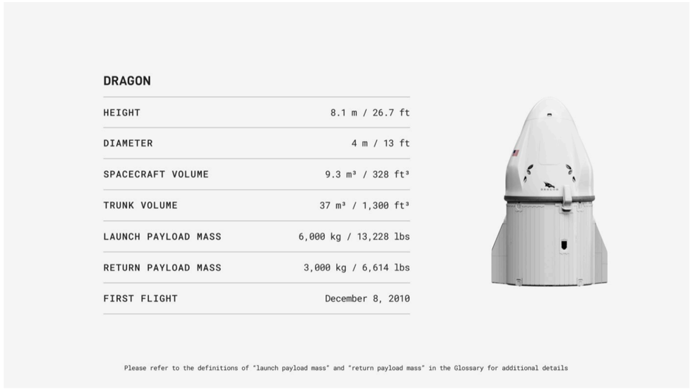

# f052 — SpaceX Dragon spacecraft spec table, 6,000 kg launch payload

This figure presents key technical specifications for the SpaceX Dragon spacecraft, showing its dimensions, volume, payload capacity, and first flight date of December 8, 2010.

The figure is a two-column spec table listing seven parameters for the Dragon capsule alongside a photograph of the vehicle. Dimensions are given as height (8.1 m) and diameter (4 m). Volume is split between pressurized spacecraft volume (9.3 m³) and unpressurized trunk volume (37 m³). Payload capacity distinguishes launch mass (6,000 kg) from the lower return mass (3,000 kg), reflecting the asymmetry between ascent and descent capability. A footnote directs readers to the Glossary for precise definitions of the payload mass terms.

| field | value |
|---|---|
| Height (m) | 8.1 |
| Height (ft) | 26.7 |
| Diameter (m) | 4 |
| Diameter (ft) | 13 |
| Spacecraft Volume (m³) | 9.3 |
| Spacecraft Volume (ft³) | 328 |
| Trunk Volume (m³) | 37 |
| Trunk Volume (ft³) | 1,300 |
| Launch Payload Mass (kg) | 6,000 |
| Launch Payload Mass (lbs) | 13,228 |
| Return Payload Mass (kg) | 3,000 |
| Return Payload Mass (lbs) | 6,614 |
| First Flight | December 8, 2010 |

**Entities:** Dragon, SpaceX, Dragon capsule, launch payload mass, return payload mass, spacecraft volume, trunk volume, December 8, 2010

