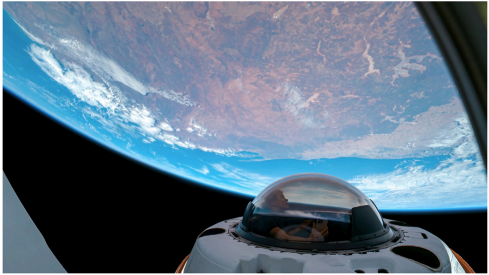

# f053 — Dragon Spacecraft Astronaut View Orbiting Earth From Polar Orbit

A photo taken from inside SpaceX's Dragon spacecraft shows an astronaut in a pressurized suit with Earth's curved surface and thin atmospheric limb visible below, illustrating Dragon's crewed orbital capability.

The image is a photograph captured from inside or just outside a SpaceX Dragon capsule during an orbital mission. An astronaut in a white pressurized spacesuit and helmet is visible in the center foreground. Earth's surface occupies the lower portion of the frame, showing landmass and cloud cover, with the thin blue line of the atmosphere visible along the upper limb. The composition emphasizes the human presence aboard Dragon in low Earth orbit.

**Entities:** SpaceX, Dragon, Dragon spacecraft, astronaut, Earth, low Earth orbit, polar orbit, pressurized suit, EVA suit, crewed spaceflight

