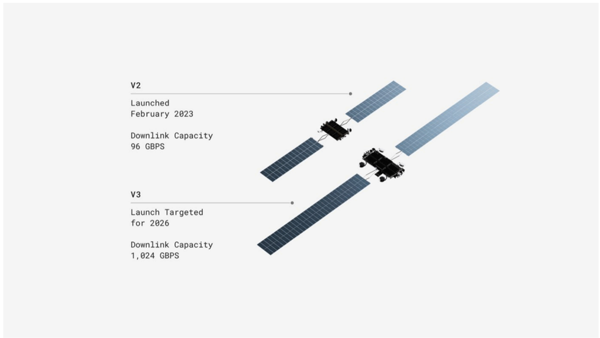

# f054 — Starlink V2 vs V3 satellite downlink capacity comparison diagram

The figure compares Starlink V2 and V3 satellite generations, showing V3's planned 1,024 Gbps downlink capacity is more than 10× the 96 Gbps of the V2 launched in February 2023.

Two satellite illustrations are shown side by side, each labeled with generation (V2 and V3) and annotated with launch date and downlink capacity. V2, launched February 2023, delivers 96 Gbps downlink capacity. V3, targeted for launch in 2026, is designed for 1,024 Gbps downlink capacity — a roughly 10.7× increase over V2. The visual size of the V3 satellite illustration appears larger than V2, suggesting a physically bigger spacecraft.

| field | value |
|---|---|
| V2 Downlink Capacity (Gbps) | 96 |
| V3 Downlink Capacity (Gbps) | 1,024 |

**Entities:** Starlink, V2, V3, SpaceX, Gbps, downlink capacity, satellite, LEO

